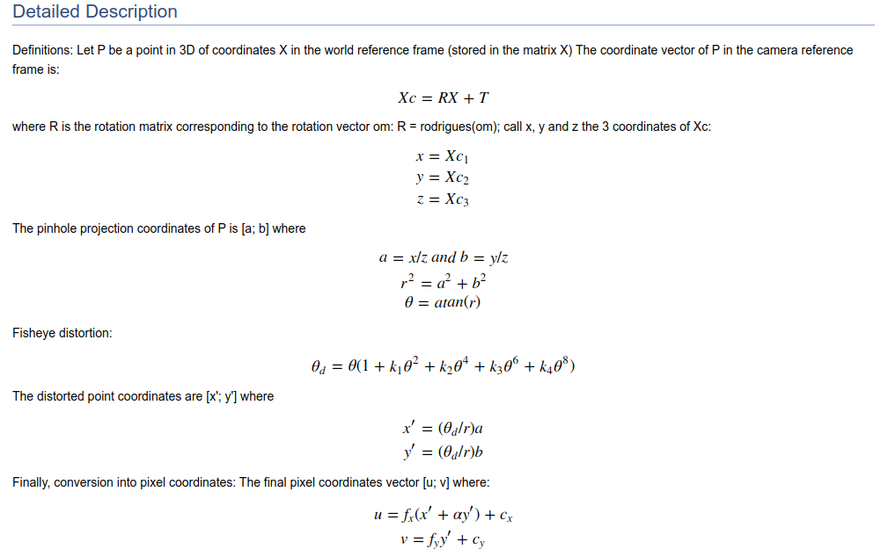

# fisheye-distortion


This script applies a fisheye distortion to rendered images. The output images can be cropped to a
rectangle and resized. The fisheye distortion is the same as detailed in OpenCV 4.4 [docs](https://docs.opencv.org/4.4.0/db/d58/group__calib3d__fisheye.html).
As mentioned in the docs, the distortion is characterized by 4 parameters, `[k1, k2, k3, k4]`, which are 
passed via the config file or command line arguments.

## Usage
The arguments for the script are passed via the config file. All the parameters in the
 config file can be overriden from the command line. You must specify:
 - The `input dir` in which to
 search for files, 
 - The `filename extention` of the input files (eg: .rgb.png, .segments.png)
 - Whether to use linear `interpolation` during distortion. For RGB images, using linear interpolation will give 
   smoother results. Other types of images (masks, normals, depth) should never use linear interpolation.

### Examples

- Distorting RGB images: Use linear interpolation to get smoother results 
```bash
python apply_fisheye_distortion.py dir.input=samples/ file_ext.input=.rgb.png linear_interpolation=True
```

- Distorting Masks: Use nearest neighbor interpolation to preserve correct values
```bash
python apply_fisheye_distortion.py dir.input=samples/ file_ext.input=.segments.png
```

- Saving output files to a different directory. A new directory will be created if it does not exist.
```bash
python apply_fisheye_distortion.py dir.output=samples/output
```

### Config file
You can edit the config file, `config.yaml`, to customize the default parameters:

```yaml
dir:
  input: samples/
  output: null  # If not specified, outputs files to same dir as input.

file_ext:
  input: .rgb.png  # The files you want to apply distortion to
  info: .info.json  # Contains camera intrinsics

linear_interpolation: False  # Enable Linear for RGB images. Else use nearest-neighbor for masks, normals and depth.
crop_and_resize_output: True  # Disable to get original distorted image. Else output will be of same resolution as input.
workers: 0  # How many processes to use to convert files. 0 for all cores in machine.

distortion_parameters:
  # Ref: https://docs.opencv.org/4.4.0/db/d58/group__calib3d__fisheye.html
  # These are the distortion parameters of a fisheye camera model as defined in the fisheye module of OpenCV 4.4.0
  k1: 0.17149
  k2: -0.27191
  k3: 0.25787
  k4: -0.08054


# Hydra specific params.
hydra:
    output_subdir: null  # Disable saving of config files.
    run:
        dir: .  # Set working dir to current directory

defaults:
    # Disable log files
    - hydra/job_logging: default
    - hydra/hydra_logging: disabled
```

## Install

### Pip
This script requires Python 3.7 or greater. The dependencies can be installed via pip:

```bash
pip install requirements.txt
```

### Docker
Alternately, you can use the provided dockerfile. 

```bash
# Build the docker image
bash docker_build.sh

# Run the docker image
bash docker_run.sh

# Inside container
$ python apply_fisheye_distortion.py dir_input=/data
```

This will process all the images found in the container's `/data` directory. Modify the
`docker_run.sh` script to change which host directory is mounted to the container's `/data`.

## Detailed Description
From OpenCV [docs](https://docs.opencv.org/4.4.0/db/d58/group__calib3d__fisheye.html),
here is the description of the fisheye camera model used to create the distortion. The
distortion co-efficients `[k1, k2, k3, k4]` are detailed below:

